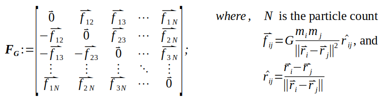
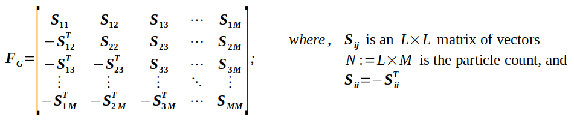
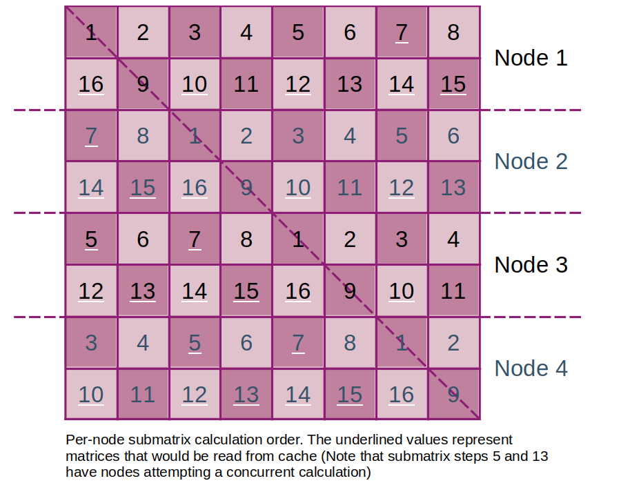
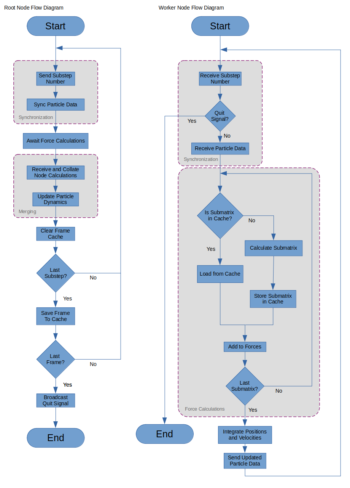

# Naive Parallel N-Body Simulation - Design Documentation
**PHYS 495** | Nikolas Nguyen | nikolasn@usc.edu

The so-called "naive" approach to N-body simulations here refers to the
calculation of pairwise inter-particle forces. This method is the most accurate
as there are no approximations in the forces or interactions; they are 
calculated for each exactly. This results, however, in an O(N<sup>2</sup>)
complexity. Some optimizations were made to allow the program to handle more
data than could otherwise fit in memory by partitioning and caching calculations
performed by the nodes. This document will begin by reviewing the theoretical
basis of the program then explain the specific choices used to implement it.

### Table of Contents
1. [Force Matrix](#force_matrix)
2. [Submatrix Method](#submat_method)
3. [Submatrix Caching](#submat_cache)
4. [MPI Implementation](#mpi_implement)
5. [Simulation Parameters](#sim_params)
6. [Particle Initialization](#part_init)

## Force Matrix <a name=force_matrix></a>
The inter-particle forces are calculated and stored in matrix form to take
advantage of FORTRAN's array capabilities. Let **F**<sub>G</sub> be the
gravitational force matrix where each element, f<sub>ij</sub>, represents the
force between particles i and j. It is clear, then that **F**<sub>G</sub> is
skew symmetric due to the equal and opposite forces between the particles.



Furthermore, to calculate the total force on particle i, we need only to sum
across each row. This is easily done in FORTRAN using `SUM(force_matrix,1)`
which will sum each row together forming an `N x 3` matrix representing the
3-dimensional gravitational force on each particle.

Below is a modified excerpt from 
[`force_grav_submat.f90`](./force_grav_submat.f90) showing how the matrix is
calculated (Note: The function actually calculates the acceleration for each
particle).

```
! fill the submatrix with the displacement vector r_i - r_j
temp_mat = SPREAD(pos,1,M)                      ! spread r_i across each row
force_matrix = SPREAD(pos,2,M)                  ! spread r_j across each column
force_matrix = temp_mat - force_matrix

! iterate over all elements
DO i = 1,M
    DO j = 1,M
        ! calculate the norm and ignore zero values
        r = NORM2(force_matrix(i,j,:))
        IF (r /= 0) THEN
            ! apply the softening, inverse square, and normalization
            r = ((r**2) + SOFTENING) * r
            r = 1.0 / r

            ! calculate the gravitational force for this element
            force_matrix(i,j,:) = -G * MASS * r * force_matrix(i,j,:)
        END IF
    END DO
END DO
``` 
First, the matrix is filled with the displacement vectors, (**r**<sub>i</sub> -
**r**<sub>j</sub>) which is itself a skew-symmetric displacement matrix. Then
for each value, the length of that vector is calculated (i.e. the distance
between the i-th and j-th particle) in order to apply the inverse square for the
gravity. A softening parameter is included here as well which prevents extreme
forces over large time steps during close encounters between particles. In the
same step, the square is multiplied again by the distance for normalizing the
displacement to determine the direction of the force.

## Submatrix Method <a name=submat_method></a>
Since the force matrix is rank `N x N x 3` where `N` is the particle count,
large simulation sizes would require too much memory to store the forces.
To resolve this, the matrix can be broken down into submatrices, 
**S**<sub>ij</sub> that can be merged later.



The force matrix composed of submatrix elements behaves with the same properties
as before; however, with each row of submatrices represents a *subset* of
particles rather than individual particles. Thus, the same general code can be
used, with different slices of the position arrays to calculate the submatrix of
the displacement matrix. (Compare the modified code above to
the original code in [`force_grav_submat.f90`](./force_grav_submat.f90)). Thus,
each node can independently calculate the forces on a subset of the particles,
perform the leap-frog integration on them, and return them to root for collating
the particle data.

To operate on large simulation sizes, the subset of particles each node must
calculate can be further subdivided into smaller partitions of data. The node
can then work on one partition (row of submatrices) at a time to calculate the
forces. The code is currently set up to calculate each partition of forces first
which is stored in a temporary array on the node and then to perform the
integration on its entire subset of particles at once.

## Submatrix Caching <a name=submat_cache></a>
To take advantage of the force matrix' skew-symmetry, a caching method was
designed allowing nodes to share calculations. The submatrices are stored in
temporary `.submat` files which are deleted in between substeps. Only the upper
triangle submatrices are stored, since the diagonal submatrices are only used
once and the negative transpose operation can be easily performed by one node
while the others work on force calculations. Each line stores a separate entry
in row-major order (i.e. element m<sub>ij</sub> of the `N x N` submatrix, **M**
is stored on line `i * M + j`).

To optimize the caching method, the nodes start with their respective upper
triangle submatrices for each row. This means they will all be working on the
same diagonals of the matrix at a time. The step at which the nodes are only
operating with cached data depends on the simulation size with larger amounts of
subdivisions being more generally more efficient.



## MPI Implementation <a name=mpi_implement></a>
As each of the worker nodes are tasked to calculate the forces of all particles
on a subset of particles, much of the process is automated in-node. The entire
process is broken down into the following phases: (1) initialization and
universal calculations which each node needs to perform before beginning; (2)
simulation setup which is primarily file management performed by root; at this
point, the timestep loop begins—(3) synchronization; (4) node calculations; (5)
merging in which the root receives and organizes node data; and (6) global
operations that must be performed by root before moving one; and (7)
finalization. All the MPI function calls are in
[`parallel.f90`](./parallel.f90) which is broken into a root operation and a
worker operation for every other node.

The initialization and universal calculations phase mainly covers each node's
MPI setup: `MPI_INIT()`, `MPI_COMM_RANK()` to determine its own rank, and
`MPI_COMM_SIZE()` to retrieve the number of processors. Additionally, each node
must allocate space for their local copy of particle data as well as the
partitioning data it needs to determine which calculations to perform. At this
point, each node must also run the paramater optimizations so that they are
operating with the same values.

The root will also be tasked with setting up the simulation workspace which
includes making a temporary directory for caching intermediate calculations and
creating a directory for the frame caches. The root is also responsible for
initializing the particle data for the first frame.

To start the synchronizing phase, the root node broadcasts the current substep
number (`(frame * SUBSTEPS_PER_FRAME) + substep`) to each worker node. The nodes
will continue to perform their calculations until the root node sends a quit
signal of `-1`. The entire array of particle data (positions and velocities)
must then be broadcast to each node. All these operations are performed using
`MPI_BCAST()`.

The calculation phase is handled entirely by the nodes as there's no global
data manipulation to perform. Each node sums over their own force submatrices in
order to calculate the total force on their subset of particles. Finally the
worker nodes perform the leap-frog integration to update their subset.

During the merging stage, each node sends its particles' data back to the root
which must collate the data into the array of all particles. This program does
this by iterating through every node and saving the data in order in a temporary
array before updating the position values. The same process is then repeated for
the particle velocities. The data passing is performed using pairs of 
`MPI_SEND()`and `MPI_RECV()` calls. This method was chosen to make sure the data
is passed in a specific order. The MPI blocking is desired since all the nodes
must be synchronized before moving to the next timestep.

The root must then perform the global file-saving operations for each frame (not
each substep) before entering the loop again.

Each node must then finalize their process. The root starts this by broadcasting
`-1` as the substep number to signal to each node that it should stop
calculations. Each node is then responsible for deallocating their dynamic
arrays (e.g. temporary arrays and particle data). Finally, `MPI_FINALIZE()` can
be called and the main program exited in each node.



## Simulation Parameters <a name=sim_params></a>
The parameters are handled in module described in 
[`sim_params.f90`](./sim_params.f90). The parameters are, for the most part 
self-explanatory (e.g. `PI`, `G` - the gravitational constant, `MASS` - mass
of each particle). 

The operation variable, `SUBDIV` indicates the number of
subdivided partitions each node should be splitting their subset of particles
into. Therefore the particles are divided into `SUBDIV x # of processes` total
partitions with each worker calculating `SUBDIV` partitions. `DOMAIN` is a
3-dimensional value giving the x, y, and z size of the simulation region. The
particles will be allowed to operate outside this region, but the domain size is
used for initialization. This way the particles will mostly be inside the final,
rendered region of the simulation. `TIMESTEPS` and `SUBSTEPS_PER_FRAME`
indicates the time increments used by the simulation. Each timestep is
equivalent to one frame at 24 FPS. 

The `SOFTENING` parameter is used to prevent large errors during near
interactions bewteen particles. To achieve this, the `SOFTENING` parameter is
added to the square of the distance in force calculations. `PCOUNT` indicates
the number of particles which may be updated for optimization using the included
subroutines: 

### `optimize_params(num_procs)`
> This subroutine uses the number of processes to ensure that the number of
particles is evenly distributed across all the worker nodes. This further
requires that the particle count is divisible by the number of subdivisions as
well. The particle count is then pared (i.e. rounded down by the modulo) so the
node calling the function can operate on the updated data. **NOTE**: Each node
must call this function or have their paramaters manually updated by root;
otherwise, the nodes may be operating with different parameters.

### `optimize_memory(num_procs,mem_per_node)`
> This subroutine was developed to allow user-specified memory allocation per
node. To achieve this, the subroutine calculates the maximum number of particles
that can fit in the indicated amount of memory then uses that value to determine
the appropriate number of subdivisions each node must have to make it to the
particle count saved in-module. **NOTE**: Each node must call this function or
have their paramaters manually updated by root; otherwise, the nodes may be
operating with different parameters.

## Particle Initializations <a name=part_init></a>
The particles are simply initialized to be evenly distributed within a sphere of
a radius equal to one-half the domain size. The initialization is performed in
spherical coordinates which allows the velocity of each particle to be set
tangential to the z-axis. The magnitude is also made to be inversely
proportional to the particles distance from the z-axis to roughly mimic orbital
velocity. More complex initialization methods are planned.